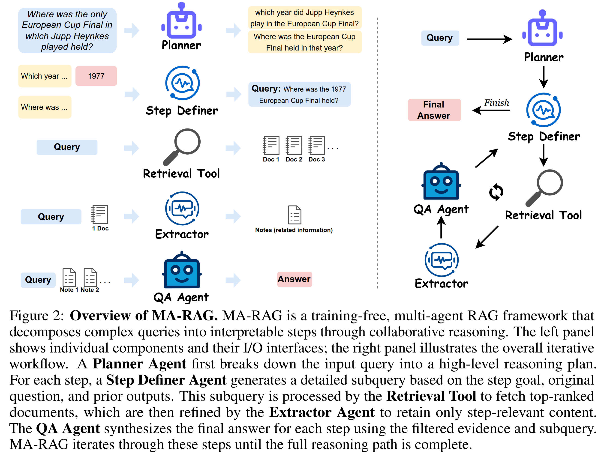

# MA-RAG: Multi-Agent Retrieval-Augmented Generation via Collaborative Chain-of-Thought Reasoning

This repository contains the source code for the paper:  
[MA-RAG: Multi-Agent Retrieval-Augmented Generation via Collaborative Chain-of-Thought Reasoning](https://arxiv.org/abs/2505.20096).



---

## Installation

```bash
cd MA-RAG
python -m venv .venv
source .venv/bin/activate
pip install -r requirements.txt
# Optional GPU FAISS (Linux + CUDA):
# pip install -r requirements-gpu.txt
```

---

## Environment

Copy `.env.sample` to `.env` and set your key:

```bash
cp .env.sample .env
```

```env
OPENAI_API_KEY=your_openai_api_key_here
MODEL_NAME=gpt-4o-mini
```

See `.env.sample` for optional paths (`MA_RAG_DATA_DIR`, `MA_RAG_INDEX_DIR`, device overrides).

---

## Ingest local documents (new in Phase 0)

For small local RAG, put `.pdf`, `.txt`, or `.md` files in `docs/`, then run:

```bash
python ingest.py ./docs
```

This writes a local FAISS index to `local_index/`. By default it uses a CPU-only hashing embedder, so it does not need a HuggingFace model download.

---

## Ask a single question (new in Phase 0)

After local ingestion:

```bash
python ask.py "Who directed Inception?"
```

`ask.py` uses `local_index/` first when available, otherwise it looks for the original DPR/Wikipedia index under `save_embs/gte-ml-base/`.

Optional JSON trace:

```bash
python ask.py "Your question here" --output-json outputs/last_run.json
```

---

## Batch benchmark (`main.py`)

1. Place KILT dev JSONL files in `data/benchmarks/` (see [data/README.md](data/README.md)).
2. Embed corpus (if needed): `python corpus/embed_corpus.py`
3. Run:

```bash
python main.py --model gpt4omini --dataset hotpotqa --exp plan_rag_extract --gpus 0
```

---

## Phase 0 fixes (this fork)

- Compatible `requirements.txt` (`faiss-cpu`, aligned LangChain pins)
- Unified `langchain_openai.ChatOpenAI` via `src/llm.py`
- `OPENAI_API_KEY` / `MODEL_NAME` env alignment (legacy `API_KEY` still works)
- Configurable data/index paths (no hardcoded `/scratch2/...`)
- Local `.pdf` / `.txt` / `.md` ingestion with `ingest.py`
- Interactive `ask.py` entry point
- CPU FAISS fallback when no GPU is available

---

## Citation

```bibtex
@article{marag2025,
      title={MA-RAG: Multi-Agent Retrieval-Augmented Generation via Collaborative Chain-of-Thought Reasoning}, 
      author={Thang Nguyen, Peter Chin, Yu-Wing Tai},
      year={2025},
      journal={arXiv preprint arXiv:2505.20096},
}
```
