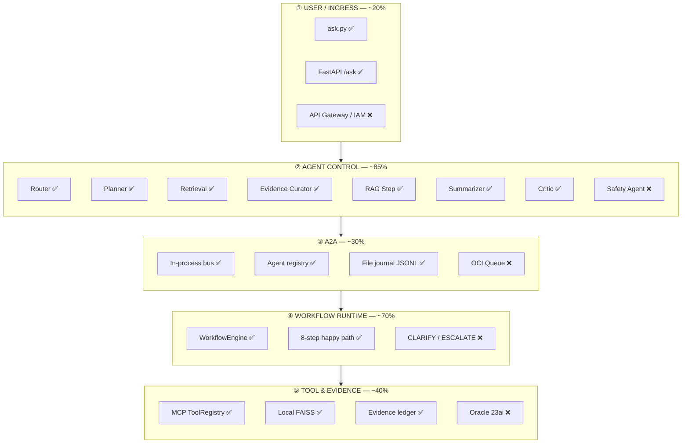
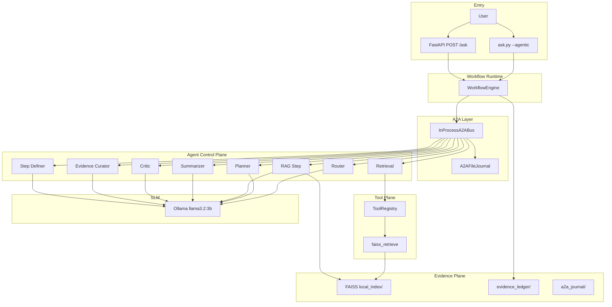
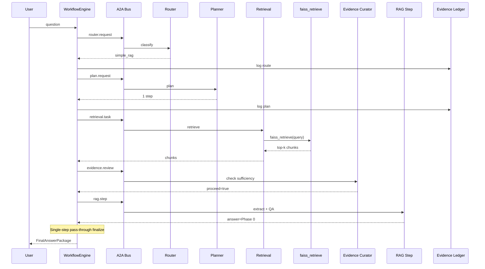
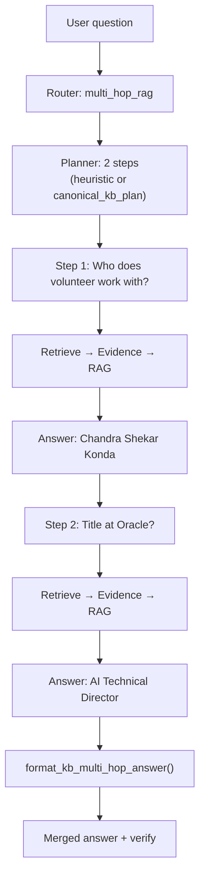
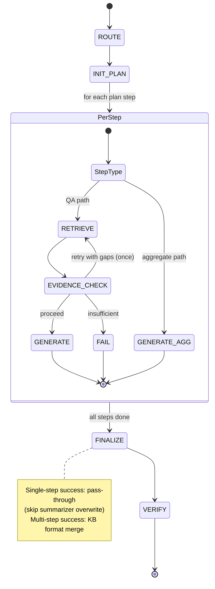
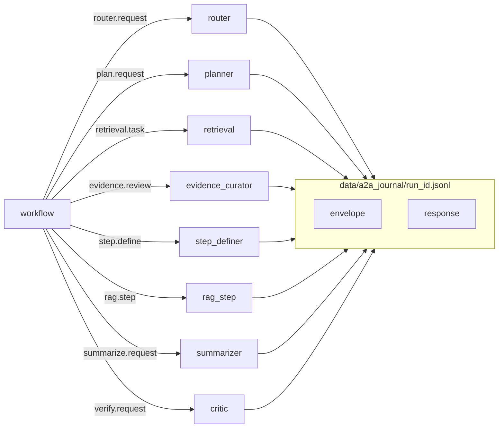
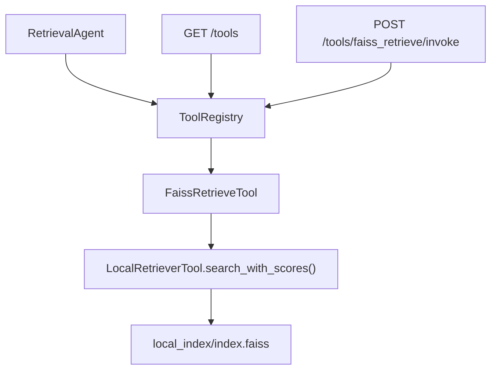
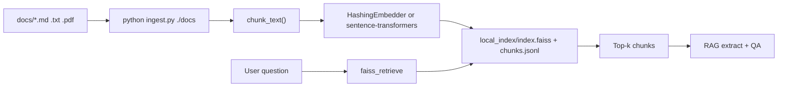
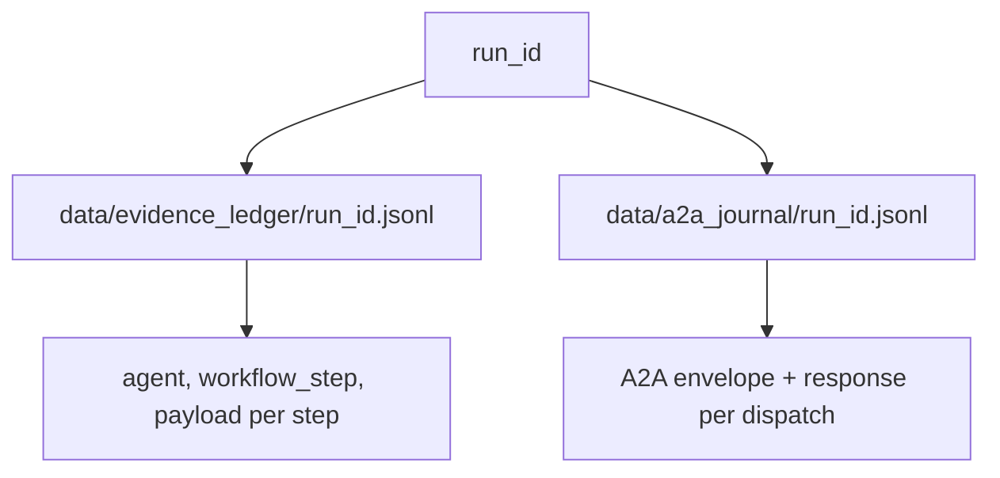

# MA-RAG — Project Updates & Architecture Notes

> **Branch:** `feature/track-b-agentic`  
> **Last updated:** 2026-06-16  
> **Implementer:** Bhargav Boyapati · **Stakeholder:** Chandra Shekar Konda   
> **Stack:** Ollama `llama3.2:3b` (SLM-first) · FAISS · FastAPI · Python 3.9

---

## 1. Executive summary

MA-RAG is a **local prototype** of an enterprise multi-agent RAG system for the **IEEE Talent Meets AI** task force. It implements:

- **8 specialized agents** (Router, Planner, Retrieval, Evidence Curator, RAG step, Summarizer, Critic, Step definer)
- **8-step workflow runtime** (route → plan → retrieve → evidence check → generate → finalize → verify)
- **On-prem SLM** via Ollama (no cloud LLM required by default)
- **FAISS** local vector index (not Pinecone)
- **MCP-style tool gateway** (`faiss_retrieve`)
- **A2A scaffolding** (in-process bus + per-run JSONL journal)
- **API ingress** (`POST /ask`)
- **Audit trails** (evidence ledger + A2A journal per `run_id`)
- **Regression tests** (`eval_kb.py` 8/8, `pytest` 14/14)

**Not production/OCI yet** — runs on Mac laptop; OCI Queue, API Gateway, IAM, and Oracle 23ai vector store are future work.

---

## 2. Timeline of updates (git commits)


| #   | Commit    | What was added                                                                                 |
| --- | --------- | ---------------------------------------------------------------------------------------------- |
| 1   | `24a7fbb` | Typed Pydantic contracts, `PlannerAgent`, `WorkflowEngine`, `ask.py --agentic`                 |
| 2   | `d5840d6` | SLM/Ollama support, Evidence Curator, Critic, evidence ledger, `eval_kb.py`                    |
| 3   | `1cd69bd` | Multi-step finalize helpers, hedging fix, tighter KB eval                                      |
| 4   | `c72a0a6` | **Router agent** (simple vs multi-hop), `PLAN.md` continuity doc                               |
| 5   | `599e675` | **MCP tool gateway**, **A2A in-process bus**, **FastAPI `POST /ask`**                          |
| 6   | `ea9c0e0` | API pytest suite, A2A file journal, rag_step on bus, heuristic multi-hop, evidence re-retrieve |


### Tracks completed


| Track         | Description                                     | Status |
| ------------- | ----------------------------------------------- | ------ |
| **Phase 0**   | Ingest, FAISS, CLI `ask.py`, project KB docs    | ✅      |
| **Track B**   | Typed agents, `WorkflowEngine`, `--agentic`     | ✅      |
| **Track C**   | Evidence Curator, Critic, JSONL evidence ledger | ✅      |
| **SLM**       | Ollama, plain-text parsers, planner/RAG fixes   | ✅      |
| **Router**    | `simple_rag` / `multi_hop_rag` triage           | ✅      |
| **Ingress**   | FastAPI API (scaffolding)                       | ✅      |
| **A2A**       | Bus + registry + file journal (scaffolding)     | ✅      |
| **MCP tools** | `faiss_retrieve` + registry                     | ✅      |
| **Tests**     | pytest 14, eval_kb 8                            | ✅      |


---

## 3. Where we are on the 5-plane OCI architecture

Reference: *Enterprise Multi-Agent RAG Architecture on Oracle Cloud Infrastructure* (5 planes).




### Plane-by-plane detail

#### ① User / Ingress plane


| Component (diagram)          | MA-RAG today                                      |
| ---------------------------- | ------------------------------------------------- |
| Web / Mobile / Teams / Slack | ❌ Not built                                       |
| API clients                  | ✅ `POST /ask`, `GET /health`, `/tools`, `/agents` |
| OCI API Gateway + WAF + LB   | ❌                                                 |
| OCI IAM                      | ❌                                                 |
| Session / tenant service     | ❌                                                 |
| Response package             | ✅ answer, confidence, route, verify, ledger paths |


**Entry points:**

```bash
python ask.py "question" --agentic    # CLI
python run_api.py                     # API server
curl -X POST http://127.0.0.1:8000/ask ...
```

---

#### ② Agent control plane


| Agent (diagram)      | File                                         | Role                              |
| -------------------- | -------------------------------------------- | --------------------------------- |
| Router / Triage      | `agents/router_agent.py`                     | `simple_rag` vs `multi_hop_rag`   |
| Supervisor / Planner | `agents/planner_agent.py`                    | Decompose question into steps     |
| Research / Retrieval | `agents/retrieval_agent.py`                  | FAISS via MCP tool                |
| Evidence Curator     | `agents/evidence_curator_agent.py`           | Sufficiency check before generate |
| RAG / QA step        | `agents/rag_step_agent.py` + `agents/rag.py` | Extract + grounded answer         |
| Summarizer           | `agents/summarizer_agent.py`                 | Merge multi-step answers          |
| Critic / Verifier    | `agents/critic_agent.py`                     | Faithfulness check                |
| Step definer         | `agents/step_definer_agent.py`               | Sub-task per plan step            |
| Safety / Compliance  | —                                            | ❌ Optional, not implemented       |


**LLM hosting (diagram: OCI GenAI):**  
**Today:** Ollama on Mac (`llama3.2:3b`). Hybrid optional via `MA_RAG_<AGENT>_PROVIDER`.

---

#### ③ A2A communication plane


| Component (diagram)             | MA-RAG today                                 |
| ------------------------------- | -------------------------------------------- |
| A2A protocol & contracts        | ✅ `src/contracts/messages.py` (Pydantic)     |
| Agent registry                  | ✅ `src/a2a/registry.py`                      |
| Message bus                     | ✅ `src/a2a/bus.py` (in-process, synchronous) |
| Per-run journal                 | ✅ `data/a2a_journal/{run_id}.jsonl`          |
| OCI Queue                       | ❌ Future                                     |
| OCI Streaming (telemetry)       | ❌                                            |
| Object Storage (large payloads) | ❌                                            |
| Remote worker process           | ❌ Next recommended build                     |


**All 8 agents** are registered on the bus. Workflow dispatches via A2A envelopes (same handlers, formal boundaries).

---

#### ④ Workflow runtime plane


| Step (diagram)   | WorkflowStep enum    | Status               |
| ---------------- | -------------------- | -------------------- |
| 0 INIT / PLAN    | `route`, `init_plan` | ✅                    |
| 1 RETRIEVE       | `retrieve`           | ✅ (+ evidence retry) |
| 2 EVIDENCE CHECK | `evidence_check`     | ✅                    |
| 3 CONTEXT BUILD  | `context_build`      | ✅                    |
| 4 GENERATE       | `generate`           | ✅                    |
| 5 VERIFY         | `verify`             | ✅                    |
| 6 FINALIZE       | `finalize`           | ✅                    |
| CLARIFY          | `clarify`            | ❌                    |
| ESCALATE         | `escalate`           | ❌                    |


**Orchestrator:** `src/workflow/engine.py`  
**State store (diagram: Autonomous DB):** JSONL files locally, not ADB.

---

#### ⑤ Tool & evidence plane


| Component (diagram)               | MA-RAG today                            |
| --------------------------------- | --------------------------------------- |
| MCP tool gateway                  | ✅ `src/tools/registry.py`               |
| MCP servers (vector, docs, …)     | ✅ One tool: `faiss_retrieve`            |
| Vector store                      | ✅ Local FAISS (`local_index/`)          |
| Evidence ledger                   | ✅ `data/evidence_ledger/{run_id}.jsonl` |
| Enterprise ingest (SharePoint, …) | ❌ Local files only                      |
| Oracle 23ai / OpenSearch          | ❌                                       |


**Supported ingest file types:** `.md`, `.txt`, `.pdf` only.

---

## 4. High-level system architecture (local deployment)




---

## 5. End-to-end request flow (single-hop)

Example: *"What is the current completed phase of the MA-RAG prototype?"*




**Output fields:** answer, confidence, route, verify_passed, run_id, evidence_ledger_path, a2a_journal_path.

---

## 6. End-to-end request flow (multi-hop)

Example: *"Who does the volunteer researcher work with, and what is that person's title at Oracle?"*




**Router triggers multi-hop when:**

- `canonical_kb_plan()` matches known KB pattern, OR
- `is_likely_multi_hop()` detects `" and "`, `"both"`, etc., OR
- `heuristic_multi_hop_plan()` splits compound questions

**Planner fallback:** If SLM returns wrong step count, heuristics override.

---

## 7. Workflow state machine (detailed)




### Per-step trace (what you see in CLI output)

```
route → init_plan → retrieve → evidence_check → context_build → generate → finalize → verify
```

---

## 8. A2A message flow




**Envelope shape** (`src/a2a/envelope.py`):

- `message_id`, `correlation_id` (= run_id)
- `from_agent`, `to_agent`, `message_type`, `payload`
- Serializable to JSONL for future OCI Queue workers

---

## 9. MCP tool layer




**Tool definition:** `faiss_retrieve`

- **Input:** `query` (string), `top_k` (int, default 3)
- **Output:** chunks with `doc_id`, `text`, `score`, `source`

**Files:**

- `src/tools/schemas.py` — ToolDefinition, ToolCallRequest, ToolCallResult
- `src/tools/faiss_retrieve.py` — wrapper
- `src/tools/registry.py` — register / list / invoke

---

## 10. Data & ingest flow




**Defaults:**

- Wiki excluded: `docs/wiki/` skipped unless `--include-wiki`
- Embedding backend: `hashing` (CPU, no download) unless `MA_RAG_LOCAL_EMBEDDING_BACKEND=sentence-transformers`

---

## 11. SLM-specific design (Ollama `llama3.2:3b`)

Small models struggle with JSON structured output. MA-RAG uses:


| Problem                              | Solution                                            | File                  |
| ------------------------------------ | --------------------------------------------------- | --------------------- |
| Bad JSON from LLM                    | Plain-text output + regex parsers                   | `src/slm_helpers.py`  |
| Planner over-plans                   | `simplify_plan_for_slm()`, heuristics               | `planner_agent.py`    |
| Wrong multi-hop steps                | `canonical_kb_plan()`, `heuristic_multi_hop_plan()` | `slm_helpers.py`      |
| Summarizer overwrites correct answer | Single-step pass-through finalize                   | `engine.py`           |
| success=No but rating=6              | QA parser reconciliation                            | `parse_qa_response()` |
| Phase 0 vs Phase 1 confusion         | Direct step answer on single-hop success            | `engine.py`           |


**Per-agent LLM config** (optional hybrid):

```env
MA_RAG_LLM_PROVIDER=ollama
MA_RAG_PLANNER_PROVIDER=openai   # optional
```

---

## 12. Audit & observability

Each `run_id` produces two JSONL trails:




**View after a run:**

```bash
cat data/evidence_ledger/<run_id>.jsonl
cat data/a2a_journal/<run_id>.jsonl
```

---

## 13. API surface


| Method | Path                   | Purpose                                 |
| ------ | ---------------------- | --------------------------------------- |
| GET    | `/health`              | LLM + index status                      |
| POST   | `/ask`                 | Run agentic workflow (summary response) |
| POST   | `/ask/full`            | Full `FinalAnswerPackage`               |
| GET    | `/tools`               | List MCP tools                          |
| POST   | `/tools/{name}/invoke` | Direct tool call                        |
| GET    | `/agents`              | List A2A-registered agents              |


---

## 14. Testing & quality gates

### Regression: `eval_kb.py` (8 cases)


| #   | Type          | Tests                                           |
| --- | ------------- | ----------------------------------------------- |
| 1   | single-hop    | Phase 0 completed                               |
| 2   | single-hop    | Volunteer researcher name                       |
| 3   | single-hop    | Oracle (Chandra's company)                      |
| 4   | **multi-hop** | Chandra + AI Technical Director (both required) |
| 5   | single-hop    | Phase 1 next                                    |
| 6   | single-hop    | IEEE Talent Meets AI                            |
| 7   | single-hop    | FAISS technology                                |
| 8   | single-hop    | MA-RAG system name                              |


```bash
python eval_kb.py          # expect 8/8
python eval_kb.py --case 4 # multi-hop only
```

### Unit/integration: `pytest`

```bash
python -m pytest tests/ -v   # expect 14/14
```

Covers: API routes (mocked), A2A journal, multi-hop heuristics, FAISS tool integration.

---

## 15. Key file map

```
MA-RAG/
├── ask.py                          # CLI (--agentic, --retrieve-only)
├── run_api.py                      # FastAPI server
├── ingest.py                       # Build FAISS index
├── eval_kb.py                      # KB regression (8 cases)
├── agents/
│   ├── router_agent.py
│   ├── planner_agent.py
│   ├── retrieval_agent.py
│   ├── evidence_curator_agent.py
│   ├── step_definer_agent.py
│   ├── rag_step_agent.py
│   ├── rag.py                      # extract + generate subgraph
│   ├── summarizer_agent.py
│   └── critic_agent.py
├── src/
│   ├── workflow/engine.py          # Orchestrator
│   ├── workflow/a2a_setup.py       # Wire agents to bus
│   ├── workflow/finalize_helpers.py
│   ├── contracts/messages.py       # Pydantic A2A contracts
│   ├── a2a/bus.py                  # In-process A2A
│   ├── a2a/file_journal.py         # Per-run A2A JSONL
│   ├── tools/                      # MCP-style faiss_retrieve
│   ├── api/server.py               # FastAPI routes
│   ├── local_retrieval.py          # FAISS + ingest
│   ├── slm_helpers.py              # Ollama parsers + heuristics
│   ├── llm.py                      # openai | ollama per agent
│   └── evidence_ledger.py
├── tests/                          # pytest suite
├── docs/
│   └── ieee_marag_project_knowledge_base.md
└── local_index/                    # FAISS (gitignored)
```

---

## 16. Commands reference (complete)

### 16.1 First-time setup

```bash
# Go to project
cd /Users/bhargavboyapati/Projects/MA-RAG

# Python virtual environment
python3 -m venv .venv
source .venv/bin/activate

# Install dependencies
pip install -r requirements.txt

# Environment file (never commit .env)
cp .env.sample .env
# Edit .env — set MA_RAG_LLM_PROVIDER=ollama

# Ollama SLM (required for default SLM-only mode)
# Install from https://ollama.com then:
ollama pull llama3.2:3b

# Verify Ollama is running
curl -s http://localhost:11434/api/tags
```

---

### 16.2 Build the knowledge index (FAISS)

```bash
source .venv/bin/activate
cd /Users/bhargavboyapati/Projects/MA-RAG

# Index all docs under ./docs (excludes docs/wiki/ by default)
python ingest.py ./docs

# Include wiki demo pages in the index
python ingest.py ./docs --include-wiki

# Index a single file
python ingest.py ./docs/ieee_marag_project_knowledge_base.md

# Custom index location
python ingest.py ./docs --index-dir ./my_index

# Custom chunk settings
python ingest.py ./docs --chunk-size 1200 --overlap 200
```

**Supported file types:** `.md`, `.txt`, `.pdf` only.

**Output:** `local_index/index.faiss` + `local_index/chunks.jsonl`

---

### 16.3 Ask questions — CLI (main path)

```bash
source .venv/bin/activate
cd /Users/bhargavboyapati/Projects/MA-RAG

# Agentic workflow (Router → Planner → Retrieval → … → Verify)
python ask.py "What is the current completed phase of the MA-RAG prototype?" --agentic

# Interactive (prompts for question)
python ask.py --agentic

# Save full trace as JSON
python ask.py "your question" --agentic --output-json ./trace.json

# Retrieval only (no LLM) — debug FAISS
python ask.py "MA-RAG phase" --retrieve-only

# Legacy LangGraph pipeline (non-agentic)
python ask.py "your question"

# LLM only — no retrieval (smoke test Ollama)
python ask.py "Say hello" --llm-only

# Use local vs DPR retriever
python ask.py "question" --retriever local
python ask.py "question" --retriever auto    # default
```

**What to look for in stderr:**

```
LLM: ollama/llama3.2:3b @ http://localhost:11434
httpx ... POST http://localhost:11434/api/chat "HTTP/1.1 200 OK"
```

---

### 16.4 API server (`POST /ask`)

**Terminal 1 — start server (leave running):**

```bash
source .venv/bin/activate
cd /Users/bhargavboyapati/Projects/MA-RAG
python run_api.py

# Custom port
MA_RAG_API_PORT=8001 python run_api.py
```

**Terminal 2 — send requests:**

```bash
# Health check
curl -s http://127.0.0.1:8000/health | python -m json.tool

# Ask (summary response)
curl -s -X POST http://127.0.0.1:8000/ask \
  -H "Content-Type: application/json" \
  -d '{"question":"What is the current completed phase of the MA-RAG prototype?"}' \
  | python -m json.tool

# Ask (full package)
curl -s -X POST http://127.0.0.1:8000/ask/full \
  -H "Content-Type: application/json" \
  -d '{"question":"What is the current completed phase of the MA-RAG prototype?"}' \
  | python -m json.tool

# List MCP-style tools
curl -s http://127.0.0.1:8000/tools | python -m json.tool

# List A2A-registered agents
curl -s http://127.0.0.1:8000/agents | python -m json.tool

# Invoke FAISS tool directly
curl -s -X POST http://127.0.0.1:8000/tools/faiss_retrieve/invoke \
  -H "Content-Type: application/json" \
  -d '{"arguments":{"query":"MA-RAG phase","top_k":3}}' \
  | python -m json.tool
```

**If port 8000 is busy:**

```bash
lsof -nP -iTCP:8000 -sTCP:LISTEN
kill <PID>
# or use another port
MA_RAG_API_PORT=8001 python run_api.py
```

---

### 16.5 Regression & unit tests

```bash
source .venv/bin/activate
cd /Users/bhargavboyapati/Projects/MA-RAG

# Full KB regression (expect 8/8) — uses Ollama + FAISS
python eval_kb.py

# Single eval case
python eval_kb.py --case 1
python eval_kb.py --case 4          # multi-hop

# Multiple cases
python eval_kb.py --case 1 --case 4

# Save machine-readable results
python eval_kb.py --json-out ./eval_results.json

# API + A2A unit tests (no Ollama needed for most)
python -m pytest tests/ -v

# Quiet summary
python -m pytest tests/ -q

# One test file
python -m pytest tests/test_api.py -v
```

---

### 16.6 Audit trails (after a run)

Use `run_id` from CLI or API output.

```bash
# Evidence ledger — per-agent workflow steps
cat data/evidence_ledger/<run_id>.jsonl

# A2A journal — every bus message/response
cat data/a2a_journal/<run_id>.jsonl

# Pretty-print JSONL
python -c "
import json, sys
for line in open('data/evidence_ledger/RUN_ID.jsonl'):
    print(json.dumps(json.loads(line), indent=2))
"
```

---

### 16.7 Environment variables (`.env`)

```env
# --- SLM (default) ---
MA_RAG_LLM_PROVIDER=ollama
OLLAMA_MODEL=llama3.2:3b
OLLAMA_BASE_URL=http://localhost:11434

# --- OpenAI fallback (optional) ---
# MA_RAG_LLM_PROVIDER=openai
# OPENAI_API_KEY=sk-...
# MODEL_NAME=gpt-4o-mini

# --- Hybrid: cloud planner, SLM for rest ---
# MA_RAG_PLANNER_PROVIDER=openai
# MA_RAG_RAG_STEP_PROVIDER=ollama

# --- Paths ---
# MA_RAG_LOCAL_INDEX_DIR=./local_index
# MA_RAG_DATA_DIR=./data
# MA_RAG_EVIDENCE_LEDGER_DIR=./data/evidence_ledger
# MA_RAG_A2A_JOURNAL_DIR=./data/a2a_journal

# --- API ---
# MA_RAG_API_HOST=127.0.0.1
# MA_RAG_API_PORT=8000

# --- Embeddings (ingest) ---
# MA_RAG_LOCAL_EMBEDDING_BACKEND=hashing
# MA_RAG_LOCAL_EMBEDDING_BACKEND=sentence-transformers
```

---

### 16.8 Git (local branch)

```bash
cd /Users/bhargavboyapati/Projects/MA-RAG

# Status
git status
git log --oneline -10

# Current branch
git branch

# Push when ready (only when you want remote backup)
git push -u origin feature/track-b-agentic
```

---

### 16.9 Troubleshooting


| Problem                       | Command / fix                           |
| ----------------------------- | --------------------------------------- |
| No FAISS index                | `python ingest.py ./docs`               |
| Ollama not running            | `ollama serve` or open Ollama app       |
| Wrong model                   | `ollama pull llama3.2:3b`               |
| Port 8000 in use              | `lsof -nP -iTCP:8000` then `kill <PID>` |
| Stuck at `quote>` in terminal | Press `Ctrl+C`, use one-line `curl`     |
| Check index exists            | `ls local_index/`                       |
| Verify SLM in use             | Look for `LLM: ollama/...` in stderr    |


```bash
# Quick health chain
curl -s http://localhost:11434/api/tags && \
ls local_index/index.faiss && \
python -m pytest tests/ -q
```

---

### 16.10 Daily workflow (recommended)

```bash
source .venv/bin/activate
cd /Users/bhargavboyapati/Projects/MA-RAG

# 1) After changing code
python -m pytest tests/ -v

# 2) After changing agents/prompts
python eval_kb.py

# 3) Manual spot-check
python ask.py "your question" --agentic

# 4) Optional API check
python run_api.py   # terminal 1
curl -s http://127.0.0.1:8000/health   # terminal 2
```

---

### 16.11 Example questions to try

```bash
# Single-hop
python ask.py "What is the current completed phase of the MA-RAG prototype?" --agentic
python ask.py "What technology is used for the local retrieval index?" --agentic
python ask.py "Who is the volunteer researcher implementing MA-RAG Phase 0?" --agentic

# Multi-hop
python ask.py "Who does the volunteer researcher on MA-RAG work with, and what is that person's title at Oracle?" --agentic
```

---

## 17. What is NOT built yet


| Area                | Gap                               |
| ------------------- | --------------------------------- |
| OCI deploy          | OKE, API Gateway, WAF, IAM        |
| A2A production      | OCI Queue, remote workers         |
| MCP production      | Full stdio/SSE MCP server process |
| Vector DB           | Oracle 23ai (using local FAISS)   |
| Safety agent        | PII / policy guardrails           |
| Workflow branches   | CLARIFY, ESCALATE                 |
| Enterprise ingest   | SharePoint, Confluence connectors |
| File types          | .docx, .html, .csv                |
| Auth / multi-tenant | API sessions                      |


---

## 18. Recommended next builds

1. **Remote A2A worker** — tail `a2a_journal/*.jsonl`, dispatch handlers out-of-process
2. **Push branch** to GitHub for stakeholder review
3. **Full MCP server** (stdio/SSE) for tool gateway integration
4. **OCI mapping doc** — which local component maps to which OCI service
5. **More ingest formats** — `.docx`, HTML

---

## 19. One-liner for employer / Chandra

> Local MA-RAG prototype implementing Planes 2, 4, and 5 of the enterprise architecture: eight typed agents on an eight-step workflow runtime, SLM-first via Ollama, FAISS evidence with MCP-style retrieval tool, in-process A2A bus with JSONL audit journals, FastAPI ingress, and 8/8 KB regression plus 14 automated API tests — ready for OCI queue-based A2A and production ingress as Phase 2.

---

*Generated for handoff and architecture review. See also `PLAN.md` for session continuity.*